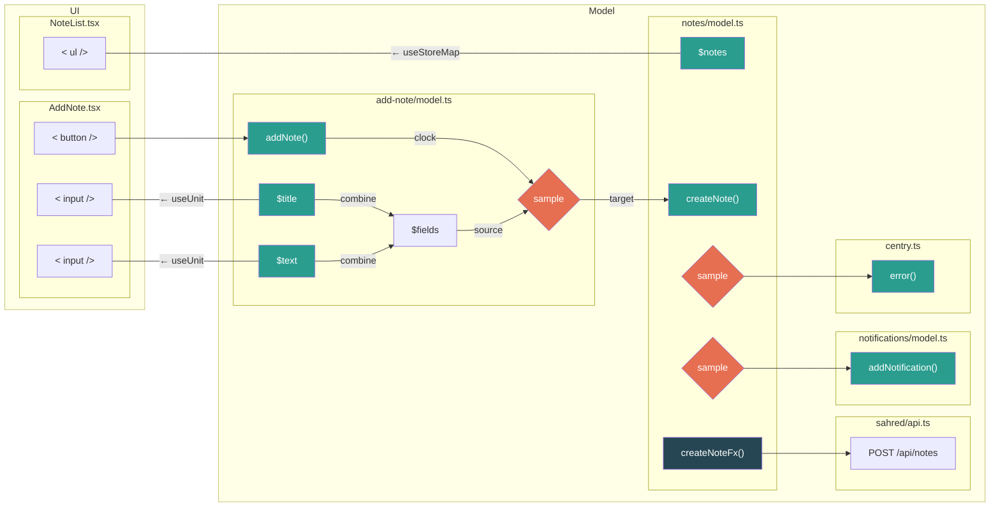

# Introduction to Effector

Эффектор - это библиотека для написания бизнес логики и управления состоянием.
https://effector.dev/
https://effector.dev/en/introduction/motivation/

Представляет собой набор инструментов для работы с состоянием, событиями и связями между ними. Состоит из **юнитов** (реактивные примитивы) и **операторов** (методы для композиции и организации потока данных между юнитами).
### Units

```ts
// событие
const createNote = createEvent<{text: string}>();

// стор
const $notes = createStore<NotesDict>({});

// эффект: обертка для сайд-эффектов (как thunk в redux)
const createNoteFx(async (args: {text: string}) => {
	return fetch(...);
})
```

Они называются юнитами, потому что несмотря на разное предназначение и особенности у них много общего.
Каждый юнит может быть как источником события, так тем кто на событие реагирует.

### Model

Моделью мы будем называть совокупность **юнитов** и их **связей** между друг другом.
Вся бизнес-логика приложения, все процессы живут в моделях, связанных друг другом так же как связаны юниты внутри конкретной модели (фичи или модуля).

Модель это "вещь в себе" и принципиально ничего не знает о UI.

```tsx
// model.ts
const createNote = createEvent<{ text: string }>();
const $notes = createStore<NotesDict>({});

$notes.on(createNote, (notes, note) => ({ ...notes, [randomUUID()]: note }));
```

А все что делает UI - это вызывает события модели и подписывается на сторы с помощью специальных хуков (в реакте).

```tsx
// add-note.tsx
<button onClick=(() => createNote({ text })))>Add</button>


// notes-list.tsx
const notes = useStoreMap($notes, notes => Object.entries(notes));

<ul>{
  notes.map(([id, {text}]) => (<li key={id}>...</li>)
}</ul>
```

**REPL: https://share.effector.dev/HE3o5yNa**

### Methods vs Operators

У юнитов есть методы, как `.on()` для подписки у стора из примера выше.  
Часть из этих методов общие для всех юнитов: `.map()`, `.filter()` `.watch()`,` .prepend()`.  
Какие-то уникальные, например `.use()` у эффекта.

Но так же у эффектора есть операторы, с помощью которых мы можем связывать юниты и описывать логику _ДеКлАрАтиВнО_ 🌈.

### Sample

Основной оператор эффектора.

`sample` - ключевой метод эффектора для создания связей и управления потоком событий.

```ts
// model.ts
const createNote = createEvent<{ text: string }>();
const $notes = createStore<NotesDict>({});

//$notes.on(createNote, (notes, note) => ({...notes, [randomUUID()]: note }));
sample({
  clock: createNote, // clock == on
  source: $notes,
  filter: (notes, note) => note.text !== '', // NEW
  fn: (notes, note) => ({...notes, [randomUUID()]: note })),
  target: $notes,
})

debug($notes) // {} -> { guid: {text: "hello"} }
```

Может показать что стало хуже, но _это не так_.
Например, с `.on()` мы ограничены тем, что `target == source == $notes`, а `sample` развязывает нам руки.

Добавим сайд-эффект.  
Выполнение http-запроса, только после успешного выполнения которого, мы обновим $notes:

```ts
// model.ts
const createNote = createEvent<{ text: string }>();
const $notes = createStore<NotesDict>({});

const createNoteFx = createEffect((args: { text: string }) => fetch(...));

sample({
  clock: createNote,
  filter: (notes, note) => note.text !== '',
  target: createNoteFx,
})

sample({
  clock: createNoteFx.doneData,
  source: $notes,
  fn: (notes, { id, text }) => ({...notes, [id]: note }),
  target: $notes
})
```

**REPL: https://share.effector.dev/n5NJdZ0f**

Добавим показ нотификации на случай если произошла ошибка.

```ts
// notes/model.ts
sample({
  clock: createNoteFx.failData,
  fn: ({ message }) => ({ type: 'error', message }),
  target: addNotification,
})


// notifications/model.ts
const addNotification = createEvent<{
  type: 'error' | 'warn' | 'info';
  message: 'string';
 }>();

const addNotificationFx = createEffect(...) // call some notification library
```

Добавим отправку ошибки в centry.

```ts
// notes/model.ts
sample({
  clock: createNoteFx.failData,
  fn: ({ message }) => ({ type: 'error', message }),
  target: addNotification,
})

sample({
  clock: createNoteFx.failData,
  filter: ({ status }) => status >= 500,
  fn: ({ message, status }) => ({ message, ... }),
  target: centryError
})
```

`sample` позволяет дробить логику на cлабосвязанные части, как в рамках конкретной модели, так и для всего приложения в целом.

При правильной организации приложения, добавление новой фичи превращается в точечное переписывание или добавление новых семплов.

### UI Model

Представим что в форме создания заметки несколько полей.
Значение для каждого поля живет в своем сторе и при отправке запроса, данные берутся из этих сторов:

Предполагается что сторы делаются максимально атомарными, тк зачастую оказывается что это банально удобнее.

```tsx
// features/add-note/model.ts
const addNote = createEvent();
const updateTitle = createEvent();
const addTag = createEvent<string>();
...

const $title = createStore("").on(updateTitle, (_, title) => title);
const $text = createStore("").on(...);
const $tags = createStore([]);
...

sample({
  clock: addNote,
  source: { title: $title, text: $text, tags: $tags },
  filter: ({ title, text }) => [title, text].every(v => v !== null && v !== ''),
  target: createNote,
})


// features/add-note/ui.tsx
const [title, text] = useUnit([$title, $text]);

<input value={title} onChange={e => updateTitle(e.target.value)} />
<input value={text} ... />
<button onClick={(() => addNote())}>Save</button>


// entity/notes/model.ts
const createNote = createEvent<{ title: string, text: string, tags?: string[] }>();
...
```

В примере выше прям сильно сократил, см. REPL.

**REPL: https://share.effector.dev/h9SV9NHB**

### Other operators

`sample` невероятно гибкий и может быть представлен во всевозможных комбинациях:

```ts
sample({ source?, clock?, filter?, fn?, target? }): target
```

- clock может не быть, тогда source вместо него.
- clock, source и target могут быть списками юнитов.
- source может быть объектом из юнитов.
- filter может быть как функцией так и стором
- если нет target, то sample возвращает новый юнит. это может быть как событие так и стор.

Все комбинации и типы возвращаемых значений перечислены документации.  
Естественно все комбинации прикрыты TS'ом и у всего работает вывод типов.

У эффектора есть еще несколько операторов входящих в core: `combine`, `merge`, `split`, `attach`.  
И более расширенный набор в отдельной библиотеке [patronum](https://patronum.effector.dev/methods ): `debug`, `debounce`, `spread`, `every` и пр.
Но всех их можно рассматривать как алиасы над sample (условно).  

Одна из идей при разработке эффектора была не превращаться в rxjs, поэтому кол-во операторов принципиально не большое, а некоторые даже будут убраны из следующей версии.

### Testing

Комфорт разработки и уверенность в результате нам дают юнит-тесты.  
Написание которых относится к ключевым фишкам эффектора.

За это отвечает [Fork API](https://effector.dev/en/api/effector/fork/).

`fork()` - создает изолированную копию всего приложения (все юниты и связи),
с возможностью подменять эффекты и значения сторов.  
А `allSettled(effect, opts)` - гарантирует что все вычисления после вызова события или эффекта будут завершены.

```ts
test("add note - success", async () => {
  const scope = fork({
   handlers: [
     [createNoteFx, () => ({ id: 1, text: "todo" })]
   ]
  });

  await allSettled(addNote, { scope, params: { text: "todo" } });

  expect(scope.getState($notes)).toMatchObject({"1": {text: "todo" }});
});

test("add note - fail", async () => {
  const addNotificationFxMock = jest.fn();

  const scope = fork({
   handlers: [
     [createNoteFx, () => throw new Error('oops')],
     [addNotificationFx, addNotificationFxMock]
   ]
  });

  await allSettled(addNote, { scope, params: { text: "todo" } });

  expect(scope.getState($notes)).toMatchObject({});
  expect(addNotificationFxMock).toBeCalledTimes(1);
});
```

### Сonclusion

Многое осталось за скобками: другие операторы и их композиция, производные юниты(derived), фабрики, библиотеки и экосистема.

Но того что мы узнали достаточно для веселого старта:

- юниты [`event`](https://effector.dev/en/api/effector/event/), [`store`](https://effector.dev/en/api/effector/store/) и [`effect`](https://effector.dev/en/api/effector/effect/)
- оператор [`sample`](https://effector.dev/en/api/effector/sample/)
- реакт-хуки [`useUnit`](https://effector.dev/en/api/effector-react/useunit/) и [`useStoreMap`](https://effector.dev/en/api/effector-react/usestoremap/)
- не используем `.watch()` ~~для логики~~, вообще его не используем, см. [`debug`](https://patronum.effector.dev/methods/debug/)
- помним что все юниты и связи должны быть объявлены статически (не в компонентах!)

Итого, основная идея эффектора в следующем:
Cобытия и сторы представляют собой контракт, на основе которого выстраиваются отношения между моделями и UI, а вся логика содержится в легко "разрываемых" и свободно переписываемых операторах.



### References

Экосистема

- https://effector.dev/en/introduction/ecosystem/
- https://patronum.effector.dev/methods - Библиотека дополнительных операторов
- https://farfetched.pages.dev/ - Типа RTK/React Query
- https://atomic-router.github.io/ - Роутер

Статьи

- https://effector.dev/en/guides/testing/
- https://effector.dev/en/guides/server-side-rendering/
- https://withease.pages.dev/magazine/
- https://withease.pages.dev/magazine/migration_from_redux
